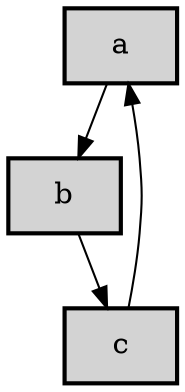

# Network graph written in elm


A network graph consists of a list of nodes connected by edges.

## Types

### Graph

```elm
type alias Graph node =
    { edges : List Edge
    , nodes : List node
    }
```

A network graph consists of a list of nodes connected by edges.

The node type of the Graph is abstract to allow you to use records extending the
type Node. Most functions provided by this work with Graph Node.

## Output options

Two outputs are supported JSON or GraphViz:




## Development

To install all tools and run `elm-make`: `make build`
